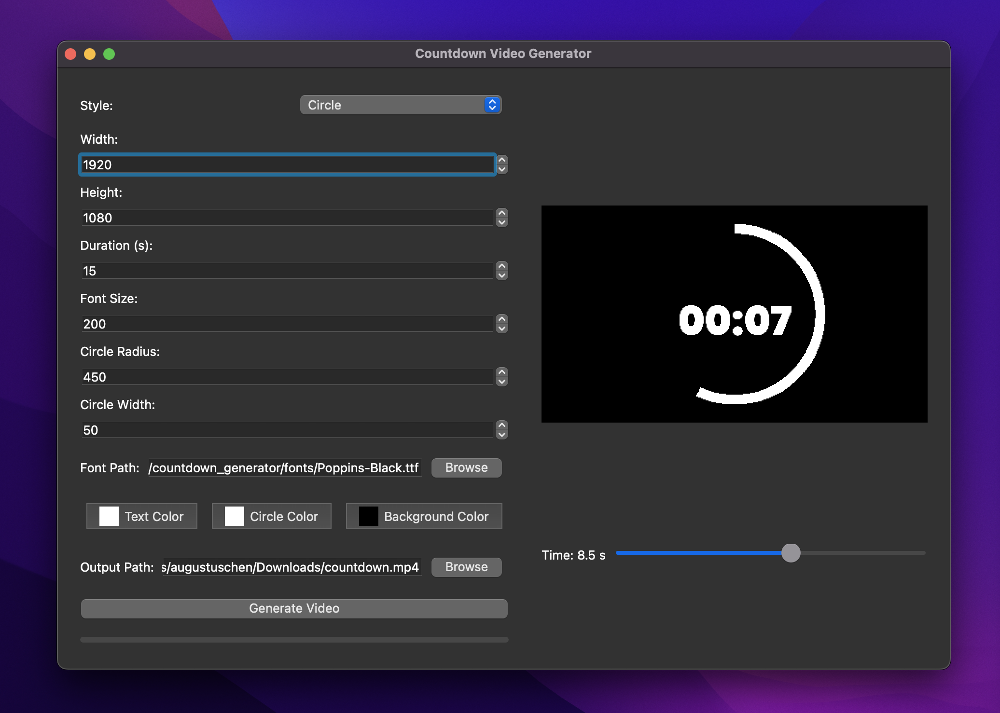

# Countdown Video Generator

Tired of being asked to pay a subscription fee for basic animations? Create one yourself using this free script.

By default, the timer comes with a black background. You can easily change the color if needed, but if you want transparency, it is not currently supported. This can be easily done in video editing software. For example, in FCP, you would use the "Luma Keyer" effect and it would be removed in an instant.

## Features

- **Two Styles**:
  - **Circle**: Progress ring with Poppins font.
  - **Digital**: Digital font, no ring.
- **Customization**: Adjust video size, length, colors, and font.
- **Preview**: See your countdown while tweaking settings.
- **Audio Beeps**: Beeps for the last 10 seconds (or entire video if shorter), with a unique final beep.

## Preview



## Installation

1. **Clone the Repository**:
```bash
git clone "https://github.com/csjaugustus/countdown_generator.git"
cd countdown_generator
```

2. **Install dependencies**:
```bash
pip install PyQt5 numpy opencv-python Pillow
```

3. **Run script**:
```bash
python3 main.py
```